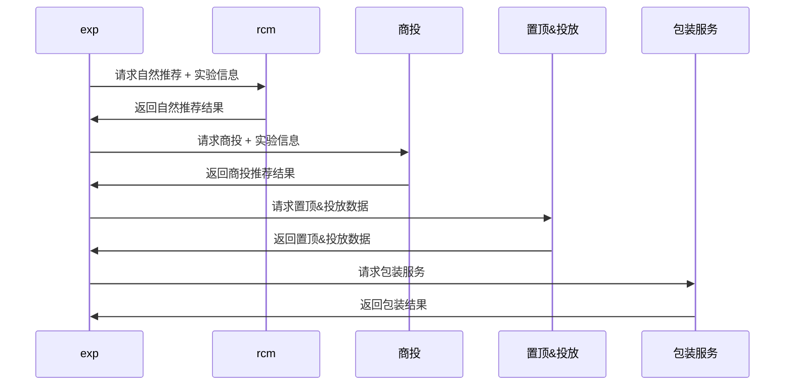
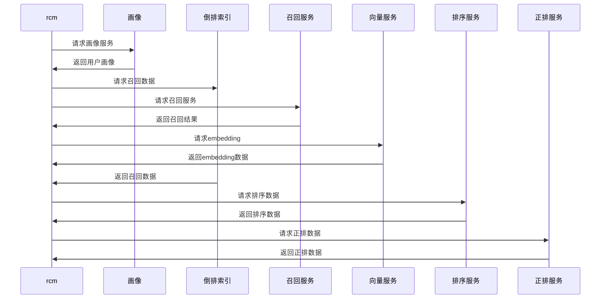
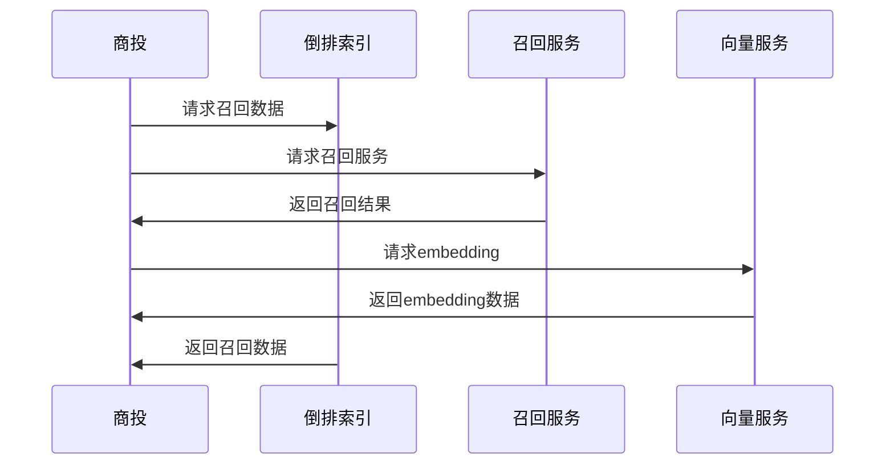
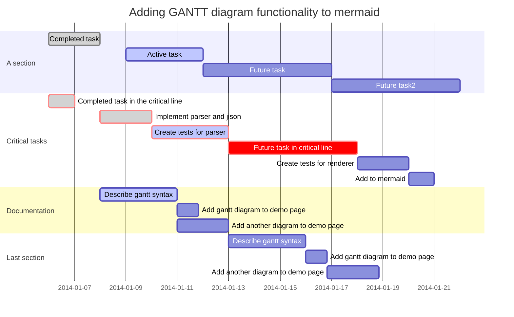
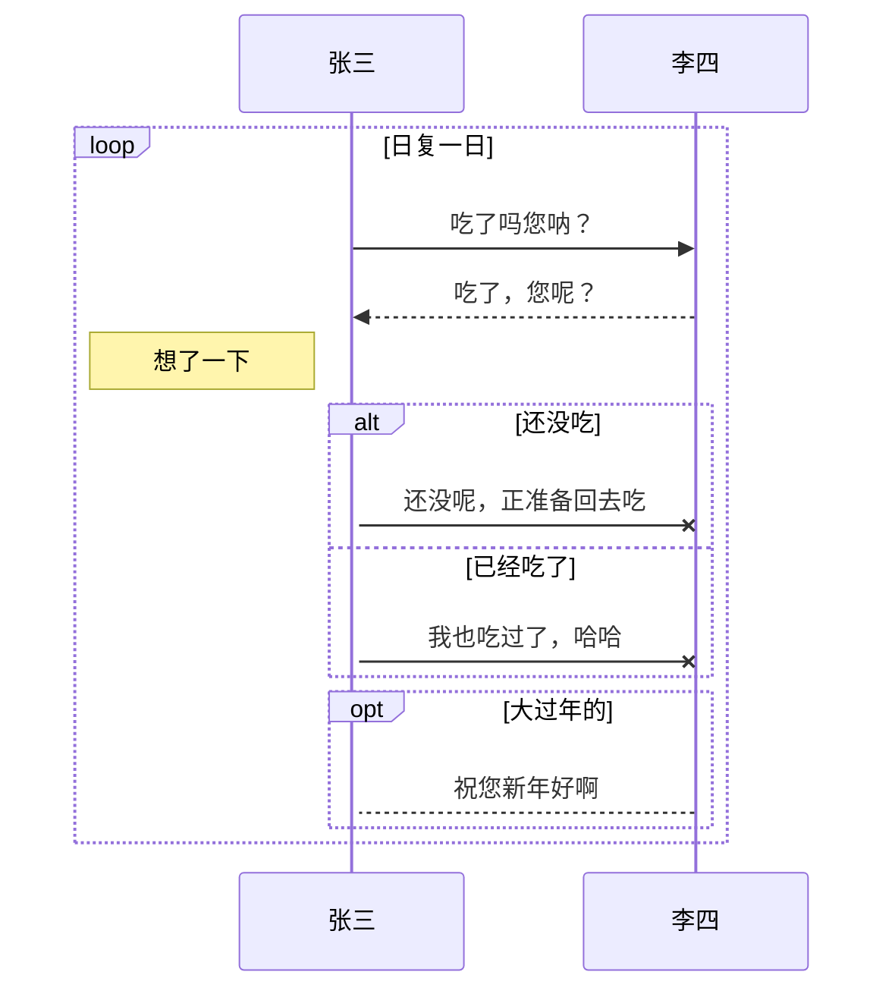

### 推荐架构

---

#### exp

---

#### rcm

#### 商投

---
#### 开发流程及问题

1. 收集频道页信息
1. 推荐引擎接入新频道或已有频道
1. DMS接入新频道页
1. 研发自测、联调、性能测试
1. QA测试
1. 当前问题
##### 一、收集频道页信息
1. 文档类信息：产品文档、接口文档、统一接口文档
1. 工程信息：线上代码分支，线上编译环境
1. api信息：线上历史接口，线上summary接口
##### 二、推荐引擎接入新频道或已有频道，引擎配置及输入输出参数（0.5天）
1. 配置PID相应的用户画像信息（APP端、M端）、用户曝光信息
1. 配置PID相应的flag信息
1. 输入输出特殊参数开发
1. exp配置PID路由信息
1. 引擎合一接口文档、测试文档、问题文档补充编写
##### 三、DMS接入新频道页
##### 四、召回模块开发
1. 召回模块从现有模块迁移到dms召回
##### 五、研发自测、联调、性能测试、
1. 基于收集到的信息进行联调、测试，以及压测
##### 六、QA测试
1. 测试环境部署
1. 测试环境压测
##### 七、当前问题
1. 信息不足，部分频道页没有完善的文档
2. 人力不足，信息收集、引擎配置、研发（周成冲、张军生），召回（袁可柔），DMS（赵广），部分人员还涉及其他项目
3. 自测不足，自测、联调、压测不足，压测、预发环境不统一
4. 效率较低，联调过程中问题解决比较慢，缺少人力支持
5. 测试配置测试环境准备不足，耗时较久，已积累文档并固定测试资源减少沟通成本
6. QA资源不足，从提测到测试需要1-2天
---
#### 排期计划

